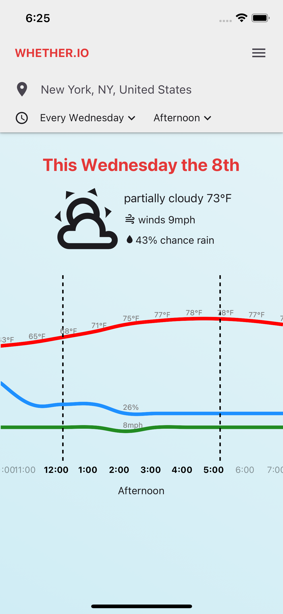
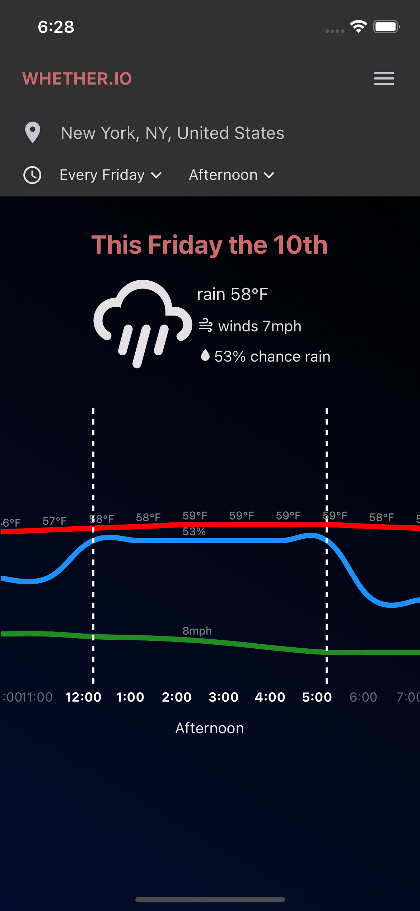

# Weather Compare

This React Native project is a basic single-page (screen) weather comparison app prototype. Priorities were in architecting a structure that could be extensible and quick to iterate on. The user should be able to compare the weather in the same location on the same weekday across multiple weeks.

  
  

Competencies Demonstrated:

- extenal API fetching and parsing
- chart implementation from data
- handling of timestamps across various timezones
- adherence to design mockup with selective liberties taken
- cross-platform picker elements
- horizontal FlatList swipeable as pages
- dark/light mode based on device settings, or toggleable
- EAS build for iOS and Android

## Stack

React Native and Expo with Redux store. React Native Paper utilized for basic UI and theming. Visual Crossing API used for weather data, and react-native-gifted-charts utilized for chart visualizations.

## [Video Demo](https://youtube.com/shorts/OXQ84GxzMcs)

Click above for a brief demonstration of the app functionality

## How to Run the App

### Android Build

Android users can download a standalone build of the app here: [Android Build]()

**Note:** Your phone will likely warn you not to download unverified apps. You can either dismiss to download anyway, or view the app in Expo Go using the method below

**NOTE:** The standalone Android build of this project will expire at some point in the future. The app will still be able to be run using the instructions below.

### Expo Go

1. Clone this repository to your local machine
2. In the terminal, navigate to the local repository directory and execute " `npx expo start` " to start the development server and display a QR code
3. Download the Expo Go app from the [App Store](https://apps.apple.com/us/app/expo-go/id982107779) or [Google Play Store](https://play.google.com/store/apps/details?id=host.exp.exponent&hl=en_US&gl=US)
4. With the Expo Go app, scan the QR code

Additional guidance can be found on the [Expo Website](https://docs.expo.dev/get-started/expo-go/)
